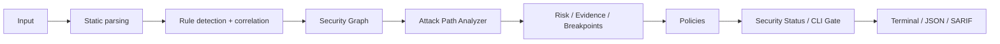

# 🛡️ Veyra

> Understand the attack path, not just the alert.

**Veyra** is a deterministic, static security analysis tool for AI-agent
components — Skills, tools, MCP servers, data, secrets, endpoints, and the
actions that connect them.

Its mission is to show **how** risky components combine into an attack path
through an agentic system, not just that a single component "looks risky".
Veyra builds a security graph, finds truthful contiguous attack paths, assigns
deterministic risk and evidence, and gates on policy violations.

> **Status: early MVP.** Veyra is a deterministic static scanner, not a complete
> malware detector and not a security standard. It does **not** detect all
> malicious skills and can produce false positives. Treat its output as a
> starting point for human review, not as a definitive verdict.

[](https://github.com/Anne117/veyra/actions/workflows/veyra.yml)

## 🎯 Why Veyra?

AI agents increasingly load third-party skills and configuration that instruct
them to take actions. A malicious or compromised skill can:

- Embed **hardcoded secrets** that get committed to source control.
- Instruct the agent to **execute arbitrary commands** (`curl | bash`).
- Make **unexpected network requests** or **exfiltrate local files**.
- Use **prompt injection** to override the host agent's system instructions.
- Point to **suspicious URLs** (raw IPs, shorteners, executable downloads).
- Read **sensitive credential files** (`.env`, `~/.aws`, `~/.ssh`).
- Hide a **download-and-execute chain** across multiple steps.
- Ship **obfuscated payloads** (base64/ROT13) that decode to dangerous actions.
- Configure a **dangerous MCP server** (remote endpoint, dynamic package
  execution, secrets passed to the server, broad filesystem access).
- Hand control to another component via an explicit **HANDOFF**, continuing an
  attack chain across components.

The alert is the starting point. Veyra's differentiator is the **path**: how a
read secret flows to an external endpoint, or how a handoff lets a risk move
through multiple otherwise-separate components.

Veyra scans these resources statically so you can review them before
trusting an agent to load them.

## ⚙️ How it works

Veyra is a deterministic, static analysis pipeline. It never executes
scanned Skills or MCP servers and never makes network requests during a scan.



The pipeline (see `src/veyra/scanner.py`, `src/veyra/graph/`, and
`src/veyra/policy.py`):

1. **Static parsing** — walk the target, skip VCS/build/vendor dirs, skip
   binary and oversized files, decode UTF-8.
2. **Rule detection + correlation** — line rules (AS-001…AS-006), file rules
   (AS-MCP-*, AS-007), correlation chains (AS-CHAIN-*), and intra-file
   step-sequence analysis produce findings.
3. **Security Graph** — build a directed, deterministic graph of nodes
   (Agent, Skill/Component, Tool/MCP Server, Data, Secret, Endpoint, Action)
   and edges (contains, uses, calls, reads, writes, sends-to, executes,
   produces, flows-to, trusts, handoff). Node identity is **semantic** (a real
   URL/path/secret resolves to one node), and findings/actions are analyzed
   **per component** to prevent cross-file correlation.
4. **Attack Path Analyzer** — deterministically enumerate truthful, contiguous
   graph walks (`READS → FLOWS_TO → SENDS_TO`), classify each into explicit
   security semantics, and mark cross-component composition **only** when the
   walk contains an explicit `HANDOFF` edge.
5. **Risk / Evidence / Breakpoints** — attach a deterministic risk model
   (`risk_score`, `risk_severity`, `risk_confidence`), structured evidence, and
   breakpoints to every attack path.
6. **Policies** — evaluate a deterministic policy engine over the finalized
   attack paths.
7. **Security Status / CLI Gate** — a single aggregate `policy_status`
   (`PASS`/`FAIL`); CLI exits non-zero on violations while preserving the
   existing severity behavior.
8. **Reporting** — terminal (with policy violations when present), JSON (with
   attack paths + policy results/status), SARIF 2.1.0, or a standalone HTML
   security report.

On top of this core pipeline sit two read-only projection layers:

- **Component security projections** (`src/veyra/graph/context.py` and
  `src/veyra/graph/declarations.py`, Commits 17–22) — explicitly declared
  component relationships, an explicit component↔security-behavior
  association, and derived per-component views (security scope, path
  participation, path composition, and risk evidence). These are additive
  metadata only and never modify the AttackPath, risk, or policy.
- **Threat Knowledge** (`src/veyra/threats/`, Commits 23–24) — a
  deterministic, read-only foundation (`ThreatScenario`, `ThreatTaxonomy`) plus
  the OWASP Agentic AI 2026 catalog. Purely descriptive; no graph/path/risk
  interaction yet.

## 🧩 Detection table

| Rule | ID | Severity examples |
|------|----|-------------------|
| Hardcoded secrets (OpenAI/Anthropic/GitHub/AWS/generic keys, passwords, private keys) | AS-001 | CRITICAL / HIGH |
| Shell / command execution (`subprocess shell=True`, `os.system`, `curl\|bash`, `eval`) | AS-002 | CRITICAL / HIGH / MEDIUM |
| Network access (HTTP clients, download-and-execute, raw-IP URLs, shorteners) | AS-003 | HIGH / MEDIUM / LOW |
| Prompt injection (ignore instructions, reveal secrets, exfiltrate files, disable security) | AS-004 | HIGH / MEDIUM |
| Suspicious URLs (raw IPs, shorteners, executable downloads, URL→shell) | AS-005 | CRITICAL / MEDIUM / LOW |
| Sensitive credential file access (`.env`, `~/.aws`, `~/.ssh`, credential/private-key files) | AS-006 | HIGH |
| Encoded content executed/fetched (base64/ROT13 + execution/fetch context) | AS-007 | CRITICAL / HIGH |
| MCP config: remote endpoints, HTTP, local/dynamic exec, secrets, broad FS, suspicious args, trust info | AS-MCP-001…010 | HIGH / MEDIUM / LOW / INFO |
| Attack chains: secret exfiltration, download-and-execute, remote MCP execution, source-to-sink exfiltration | AS-CHAIN-001…004 | CRITICAL / HIGH |

Matched secrets are **redacted** in reports — full secrets never appear.

## 📋 Findings

Every finding carries structured metadata to help a security engineer triage
quickly and consistently across terminal, JSON, and SARIF output.

| Field | Meaning |
|-------|---------|
| `rule_id` | The rule that fired (e.g. `AS-001`, `AS-MCP-006`, `AS-CHAIN-002`). |
| `severity` | **How dangerous the behavior is** (`CRITICAL`/`HIGH`/`MEDIUM`/`LOW`/`INFO`). |
| `confidence` | **How reliably Veyra matched the behavior** (`HIGH`/`MEDIUM`/`LOW`). |
| `cwe` | CWE IDs (only where defensible; never fabricated). |
| `mitre` | Approved MITRE ATT&CK mappings (only where justified). |
| `matched_text` | The exact source line that triggered the rule (redacted for secrets). |
| `evidence` | Rule-specific evidence (secrets are redacted). |
| `remediation` | Recommended fix. |
| `suppressed` | Whether the finding was suppressed by `.veyra.toml`. |

**Severity vs. confidence:** severity answers *how dangerous the behavior is*;
confidence answers *how reliably the behavior matches the rule*. They are
independent. A high-severity finding can be low-confidence, and vice versa.

See `docs/finding-model.md` for the full field reference and the CWE mapping.

## 🔌 MCP security analysis

Veyra scans MCP (Model Context Protocol) server configuration files for
security issues. It supports `.mcp.json`, `mcp.json`, `mcp_servers.json`, and
structurally identifiable JSON/YAML MCP configs.

MCP-specific rules (IDs `AS-MCP-001` … `AS-MCP-010`):

| Rule | ID | Severity |
|------|----|----------|
| Remote MCP endpoint | AS-MCP-001 | MEDIUM |
| HTTP endpoint without HTTPS | AS-MCP-002 | HIGH |
| Local command execution | AS-MCP-003 | MEDIUM |
| Dynamic package execution (npx/npm/uvx/pip) | AS-MCP-004 | MEDIUM |
| Environment variables passed to server | AS-MCP-005 | LOW |
| Secret-looking environment variables | AS-MCP-006 | HIGH |
| Broad filesystem/path access | AS-MCP-007 | MEDIUM |
| Suspicious command arguments | AS-MCP-008 | HIGH |
| Remote URL + executable/download behavior | AS-MCP-009 | HIGH |
| Missing/ambiguous server trust information | AS-MCP-010 | INFO |

> A remote or unfamiliar MCP server is **not** labeled malicious by itself.
> Remote endpoints are flagged MEDIUM with context; only concrete risk signals
> (plain HTTP, secrets passed, broad FS access, dangerous flags) raise severity.

MCP scanning is **fully static**: Veyra never executes MCP commands,
never starts MCP servers, never connects to endpoints, never downloads
packages, and never resolves or contacts remote URLs.

## 📦 Installation

```bash
# from the project root
python -m venv .venv
.venv/Scripts/python -m pip install -e ".[dev]"   # Windows
# or: source .venv/bin/activate && pip install -e ".[dev]"  # macOS/Linux
```

Requires Python 3.9+.

## 🚀 Usage

```bash
veyra scan ./path/to/skill
veyra scan ./path/to/skill --format json
veyra scan ./path/to/skill --format sarif > report.sarif
veyra scan ./path/to/skill --format html > report.html
```

### HTML Security Report

`--format html` emits a self-contained, deterministic HTML Security Report (dark
security-oriented UI, inline CSS only — no network, CDN, or JavaScript). It
renders the scan summary, every attack path as a visual graph (nodes derived
from `path.nodes`, edges from `path.edges`, with labeled edge types and
semantic node types) plus a separate **Associated evidence** representation,
per-path **Provenance** (which scanned component/file contributed each node
and edge), a per-path **Explanation** (summary, steps, impact, policies,
breakpoints, components), per-path **Component Context** (which declared
Agent/Skill/Tool/MCP component owns each security behavior edge), policy
results, and the original findings. When explicit component context is
supplied, it also renders the **Component Security Scope**, **Component Path
Participation**, **Component Path Composition**, and **Component Risk
Evidence** sections. All dynamic values (from scanned files, node IDs,
evidence, provenance, etc.) are HTML-escaped, so malicious content cannot inject
markup. Open it directly from disk:

```bash
veyra scan ./path/to/skill --format html > report.html
```

### Exit codes (CI-friendly)

- `0` — no HIGH/CRITICAL findings **and** no policy violations
- `1` — at least one HIGH finding, or at least one violated policy
- `2` — at least one CRITICAL finding

The failure threshold is configurable with `--fail-on`. Policy violations
(`ScanResult.policy_status == "FAIL"`) also force a non-zero exit, while
preserving the severity behavior above. So a scan with a policy violation but
no CRITICAL findings exits `1`; a scan with CRITICAL findings exits `2`.

```bash
veyra scan ./path --fail-on CRITICAL   # only fail on critical
veyra scan ./path --fail-on MEDIUM    # fail on medium or higher
```

### JSON output

```bash
veyra scan ./path --format json
```

```json
{
  "target": "./path",
  "score": 72,
  "risk_level": "HIGH",
  "summary": { "critical": 1, "high": 1, "medium": 0, "low": 0 },
  "findings": [ ... ],
  "attack_paths": [
    {
      "path_id": "9e6797830b74fa5d036b38ae31386192208da5a85bda8b3396c4e9cc6d8543ce",
      "nodes": ["SKILL:skill", "SECRET:token", "DATA:payload", "ENDPOINT:https://example.com"],
      "edges": [
        {"source": "SKILL:skill", "target": "SECRET:token", "type": "READS"},
        {"source": "SECRET:token", "target": "DATA:payload", "type": "FLOWS_TO"},
        {"source": "DATA:payload", "target": "ENDPOINT:https://example.com", "type": "SENDS_TO"}
      ],
      "associated_edges": [],
      "attack_type": "SECRET_EXFILTRATION",
      "entry_node": "SKILL:skill",
      "asset_node": "SECRET:token",
      "sink_node": "ENDPOINT:https://example.com",
      "risk_score": 95,
      "risk_severity": "CRITICAL",
      "risk_confidence": "HIGH",
      "evidence": ["secret read", "data transformation", "sensitive data flow", "external network send"],
      "breakpoints": [ ... ],
      "explanation": "A secret flows to an external endpoint."
    }
  ],
  "policy_results": [
    {
      "policy_id": "SECRET-EXFILTRATION-001",
      "path_id": "9e6797830b74fa5d036b38ae31386192208da5a85bda8b3396c4e9cc6d8543ce",
      "violated": true,
      "reason": "Proven secret exfiltration reaches an external endpoint."
    }
  ],
  "policy_status": "FAIL",
  "component_security_scopes": [ ... ],
  "component_path_participation": [ ... ],
  "component_path_composition": [ ... ],
  "component_risk_evidence": [ ... ]
}
```

`attack_paths` is present only when the Security Graph reveals a real
object-continuity path (or an explicit `HANDOFF` chain). Each path carries a
deterministic `path_id`, its ordered nodes/edges, attack type, and the
risk/evidence/breakpoint fields. `policy_results` is the complete policy
evaluation; `policy_status` is the aggregate `PASS`/`FAIL` decision. When
explicit component-context associations are supplied, the additive
`component_security_scopes` / `component_path_participation` /
`component_path_composition` / `component_risk_evidence` fields are emitted
(and omitted when empty). These fields are added **without** changing the
existing `target`/`score`/`risk_level`/`summary`/`findings` schema.

### Attack Paths

Every scan builds a lightweight Security Graph and runs a deterministic Attack
Path Analyzer over it (no LLM, no runtime). A path is emitted only when the
graph shows actual continuity — a read Secret/data object that FLOWS_TO a
derived object which is SENDS_TO an external endpoint. Shared-skill correlation
alone (a skill reads a secret *and* also contacts an endpoint) is not reported
as a proven path.

Each path is classified into explicit security semantics:

- `SECRET_EXFILTRATION` — a secret flows to an external endpoint (proven by
  a contiguous `READS → [FLOWS_TO] → SENDS_TO` object lineage).
- `DATA_EXFILTRATION` — sensitive data flows to an external endpoint (same
  lineage requirement).
- `CORRELATED_SECRET_EXECUTION` — a secret is read by the skill and the same
  skill executes an action. This is a **correlation**, not a proven
  secret→action flow; it is never described as data reaching the action.
- `UNKNOWN` — the path does not satisfy any proven pattern.

Exfiltration classification is conservative: the asset must be connected to
the sent object by an actual contiguous edge sequence (READS → FLOWS_TO*
→ SENDS_TO). A `SENDS_TO` that does not originate from the asset lineage, or
`USES`/`PRODUCES` edges, never produce an exfiltration type.

A path exposes its `attack_type`, `entry_node`, `asset_node`, `sink_node`,
`path_id`, deterministic `risk_score`/`risk_severity`/`risk_confidence`, a
structured `evidence` list, and a deterministic `explanation`. The classifier
never fabricates an asset or sink that is not present in the path, and never
treats `USES` (a request) or `PRODUCES` (skill output) as
exfiltration/data-flow.

Terminal output shows a concise section when paths exist:

```
Attack Paths
-----------
  [CRITICAL] [SECRET_EXFILTRATION] risk=95 (id 4f82a91c3d) Secret exposed to external endpoint
    SKILL:skill → SECRET:token → DATA:payload → ENDPOINT:https://example.com
    (SECRET_EXFILTRATION: A secret flows to an external endpoint.)
    Breakpoints:
      - READS: Restricts access to the sensitive asset.
      - FLOWS_TO: Breaks the proven data lineage.
      - SENDS_TO: Prevents transmission to the external endpoint.
```

#### Component composition (HANDOFF)

A component transfer is represented by an **explicit `HANDOFF` edge**
(`SKILL:A --HANDOFF--> SKILL:B`). Composition is claimed **only** when an
ordered attack-path walk actually contains that `HANDOFF` edge — never inferred
from shared names, endpoints, data, or producer/consumer relationships. Branches
and multi-hop chains are enumerated deterministically, e.g.
`A -> B`, `A -> C`, and `A -> B -> D`. A pure handoff chain is a **component
transfer** (`attack_type = UNKNOWN`, `risk_score = 0`); it does not by itself
prove secret or data exfiltration.

```
[INFO] [UNKNOWN] risk=0 (id 0bbe7892f0) Cross-component control handoff
  SKILL:A → SKILL:B
  Components: A → B
```

A composed path is always the control-transfer walk itself (`attack_type =
UNKNOWN`, `risk_score = 0`); composition itself never becomes an exfiltration
semantic. If a component in the chain also carries a separate proven
exfiltration path, that path is emitted as its own single-component walk, not
merged into the composed one.

### Policies & security status

Every finalized attack path is evaluated by a deterministic **policy engine**
(`src/veyra/policy.py`). Built-in policies:

- `SECRET-EXFILTRATION-001` — a proven `SECRET_EXFILTRATION` violates it.
- `DATA-EXFILTRATION-001` — a proven `DATA_EXFILTRATION` violates it.
- `CORRELATED-SECRET-EXECUTION-001` — a correlated secret+execution requires
  review (a review policy, not a proven-data-flow claim).

Each produces a `PolicyResult` (`policy_id`, `path_id`, `violated`, `reason`).
`ScanResult.policy_status` is the aggregate decision: `"FAIL"` iff any policy is
violated, else `"PASS"`. Terminal output shows a **Policy Violations** section
only when at least one policy is violated:

```
Policy Violations
----------------
- SECRET-EXFILTRATION-001
  Path: 9e6797830b74fa5d036b38ae31386192208da5a85bda8b3396c4e9cc6d8543ce
  Reason: Proven secret exfiltration reaches an external endpoint.
```

`ScanResult` also exposes a derived summary: `policy_violation_count`,
`has_policy_violations`, `violated_policy_ids`, and `violated_path_ids`.

### SARIF output

Veyra emits **SARIF 2.1.0** for compatibility with GitHub Code Scanning
and other SARIF-compatible security tooling. SARIF generation is fully static
(no network requests, no code execution). Suppressed findings are preserved via
SARIF's `suppressions` array — they are never silently turned into clean
secrets remain redacted. When a scan produces attack paths, each is additionally
emitted as a SARIF result (level mapped from its existing risk severity, rule id
derived from its attack type) with the path's `path_id`, `attack_type`, risk
fields, evidence, and breakpoints exposed under the result's `properties`. When
explicit component context is supplied, the run-level properties also expose
`component_security_scopes`, `component_path_participation`,
`component_path_composition`, and `component_risk_evidence` as additive (never
fabricated) metadata.

### Component declarations, context, security scope, participation, composition, and risk evidence

Veyra keeps **six distinct additive layers** over the Security Graph — never
merged, never inferred:

- **Component Declarations** (`graph/declarations.py`) — explicit architecture
  relationships: `AGENT USES SKILL`, `SKILL HANDOFF SKILL`, `AGENT CALLS TOOL`,
  etc. These describe how components relate to each other.
- **Component Context** (`graph/context.py`, Commit 18) — explicit association
  of a security-behavior edge (READS / WRITES / SENDS_TO / EXECUTES / PRODUCES /
  FLOWS_TO) with a component: `associate_security_behavior(graph, ("SKILL:A",
  "SECRET:x", READS), ComponentContext("SKILL:A", SKILL))`.
- **Component Security Scope** (`graph/context.py`, Commit 19) — a
  deterministic, read-only aggregation of those explicit context associations
  into per-component projections:
  `build_component_security_scopes(graph)` →
  `serialize_component_security_scopes(graph)`.
- **Component Path Participation** (`graph/context.py`, Commit 20) — the
  subset of a component's explicitly associated security behaviors that are
  actually present on a particular finalized AttackPath:
  `build_component_path_participation(path, context)` /
  `build_component_path_participation_for_paths(paths, context)` →
  `serialize_component_path_participation(...)`.
- **Component Path Composition** (`graph/context.py`, Commit 20) — a
  deterministic path-level grouping of the explicitly participating
  components in a finalized AttackPath and their proven behaviors:
  `build_component_path_composition(path, context)` /
  `build_component_path_composition_for_paths(paths, context)` →
  `serialize_component_path_composition(...)`.
- **Component Risk Evidence** (`graph/context.py`, Commit 22) — a deterministic
  projection of the finalized AttackPath's risk metadata onto explicitly
  participating components:
  `build_component_risk_evidence(path, context)` /
  `build_component_risk_evidence_for_paths(paths, context)` →
  `serialize_component_risk_evidence(...)`.

```
build_component_security_scopes(graph) ==
[
  ComponentSecurityScope(
    component=ComponentContext("SKILL:A", SKILL),
    security_behaviors=(("SKILL:A", "READS", "SECRET:x"),),
  )
]
```

The scope projection:

- is **NOT** a new graph relationship and creates **no** edges;
- is **NOT** an ownership inference engine;
- preserves multiple components explicitly associated with the same security
  edge (each yields its own independent scope — Veyra never decides a "real"
  owner);
- deduplicates identical `(component, behavior edge)` pairs;
- sorts deterministically by `(component_type, component_id)` and behaviors by
  `(source, edge_type, target)`;
- references only actual existing security edges and raises
  `ComponentContextError` on stale/invalid metadata;
- does not mutate the graph or the AttackPaths.

**Veyra never infers ownership** from `USES`, `CONTAINS`, `CALLS`, `TRUSTS`,
`HANDOFF`, file paths, node IDs, provenance, labels, findings, or naming. So
`AGENT USES SKILL` alone does **not** create an `AGENT → security behavior`
association or an `AGENT → ComponentSecurityScope` — only an explicit
`ComponentContextAssociation` establishes component security scope.

The projection is exposed additively in reports: JSON
`component_security_scopes` (top-level), SARIF
`run.properties.component_security_scopes`, and a compact **Component Security
Scope** HTML section. `attack_paths[*].context_components` is unchanged.

**Component Security Scope becomes visible in scan/report output ONLY when
explicit component-context associations are supplied** to the scanner:

```python
from veyra.scanner import scan_path
from veyra.graph import ComponentContext, ComponentContextAssociation, NodeType, EdgeType

result = scan_path(
    "path",
    component_context=[
        ComponentContextAssociation(
            edge_key=("SKILL:checkout", "SECRET:.env", EdgeType.READS),
            component=ComponentContext("SKILL:checkout", NodeType.SKILL),
        ),
    ],
)
result.component_security_scopes  # populated from the explicit associations
```

With no explicit associations the field stays empty and reporting is unchanged—
no ownership is inferred from `USES`, `CONTAINS`, `CALLS`, `TRUSTS`, `HANDOFF`,
file paths, node IDs, labels, provenance, findings, or naming. Each supplied
association is re-validated (its edge and component must actually exist in the
scan's merged graph) and stale/invalid associations raise
`ComponentContextError` deterministically.

### Component Path Participation

**Component Path Participation** answers *"which explicitly declared components
participate in a given AttackPath, and which of their security behaviors are
actually present on that path?"*

The rule is strict:

> **GRAPH MEMBERSHIP ≠ ATTACK-PATH PARTICIPATION.**

A component participates in an AttackPath iff:

1. there is an **explicit** `ComponentContextAssociation` for that component;
2. the associated security-behavior edge is an **actual edge of that AttackPath**
   — either a `path.edges` walk edge or a `path.associated_edges` edge — matching
   the exact `(source, edge_type, target)` triple.

An association whose edge exists in the graph but is **not** on the path simply
does not make the component participate in that path. `USES`, `CONTAINS`,
`CALLS`, `TRUSTS`, `HANDOFF`, file paths, node IDs, labels, provenance, and
naming never establish security ownership or path participation.

The scope projection may contain many behaviors; a particular path contains
only the ones actually on it. For example a scope with both `READS` and
`SENDS_TO` produces a participation object holding only the `READS` behavior
when `SENDS_TO` is not on that path.

Exposed additively in reports: JSON `component_path_participation` (top-level),
SARIF `run.properties.component_path_participation`, and a compact **Component
Path Participation** HTML section. It is metadata only — it never creates a
graph edge, never modifies the AttackPath, and is never part of path_id, risk,
evidence, breakpoints, or policy.

### Component Path Composition

**Component Path Composition** answers *"which explicitly declared security
components participate in this AttackPath, and in what deterministic order do
their proven security behaviors occur along that path?"*

It is a deterministic, read-only projection over an already-finalized
AttackPath plus explicit `ComponentContextAssociation` metadata — NOT ownership
inference, NOT a new attack type, NOT a new graph edge, and NOT a replacement
for AttackPath. A component appears in a composition only if an explicit
association exists for it AND its referenced security-behavior edge (a
`path.edges` walk edge or a `path.associated_edges` edge) is an actual edge of
that specific path.

> **COMPONENT PATH COMPOSITION DOES NOT CREATE COMPONENT RELATIONSHIPS.**

The composition is a flat collection of explicitly participating components
and their proven behaviors; it never invents a component-to-component edge —
even when two components are associated with the same path edge, both are
preserved with no owner or responsibility ranking. `associated_edges` are valid
participation evidence but are never treated as contiguous path sequence
edges.

Exposed additively in reports: JSON `component_path_composition` (top-level),
SARIF `run.properties.component_path_composition`, and a compact **Component
Path Composition** HTML section. It is metadata only and never part of path_id,
risk, evidence, breakpoints, or policy.

### Component Risk Evidence

**Component Risk Evidence** answers *"what risk-relevant security behaviors of
each explicitly participating component are evidenced by this specific
AttackPath?"* It connects the finalized AttackPath, its ComponentPathComposition,
and the already-computed AttackPath risk/evidence.

The distinctions:

- **AttackPath Risk** = risk of the complete proven path.
- **Component Path Composition** = which explicit components participate and
  which behaviors they prove.
- **Component Risk Evidence** = which existing AttackPath evidence labels are
  evidenced by each participating component.

Two cardinal rules:

> **COMPONENT RISK EVIDENCE DOES NOT REDISTRIBUTE ATTACKPATH RISK.**

> **COMPONENT RISK EVIDENCE DOES NOT ESTABLISH OWNERSHIP OR RESPONSIBILITY.**

Every `ComponentRiskEvidence` entry:

- copies `risk_severity` / `risk_confidence` verbatim from the finalized
  AttackPath (never recalculated per component);
- emits evidence that is always a **subset of the AttackPath.evidence** (it can
  never manufacture a label the path itself did not establish);
- has **no** component risk score, percentage, responsibility, or ownership —
  only explicit participation counts.

The behavior→evidence mapping uses only the existing AttackPath evidence
vocabulary and the actual behavior triple / graph node type:

| Behavior | Evidence label |
|---|---|
| `READS` → SECRET node | `secret read` |
| `READS` → DATA node | `sensitive data read` |
| `FLOWS_TO` | `sensitive data flow` |
| `SENDS_TO` | `external network send` |
| `EXECUTES` | `execution` |
| `WRITES` / `PRODUCES` | *(no label)* |

Exposed additively in reports: JSON `component_risk_evidence` (top-level), SARIF
`run.properties.component_risk_evidence`, and a compact **Component Risk
Evidence** HTML section. It is purely downstream metadata — it never draws
arrows between components, never claims causal attribution, probability, or
exploitability scoring, and never modifies the AttackPath.

## 🚫 Suppression / allowlist

You can suppress known-safe findings with a project configuration file,
`.veyra.toml`:

```toml
[ignore]
servers = ["filesystem"]          # ignore MCP servers by name
domains = ["trusted.example.com"] # ignore findings for these domains
rules = ["AS-MCP-010"]            # ignore specific rule IDs
```

- Suppression is applied **after** findings are generated, never inside rules.
- Suppressed findings are **marked** (`suppressed: true` + a reason) and remain
  distinguishable from findings that were never detected.
- Terminal output shows `[SUPPRESSED]` lines; JSON output includes
  `"suppressed": true` and a `"suppressed"` count in the summary.
- Suppression is **never silent** — it is always visible in the report.

## 🧪 Attack Lab

Veyra ships an internal adversarial corpus (`tests/fixtures/attacks/`)
and an evaluator (`veyra attack-lab`) that measures detection on that
corpus.

**On the current 95-case internal Attack Lab corpus:**

| Metric | Value |
|--------|-------|
| Total cases | 95 |
| Detected | 88 |
| Partially detected | 7 |
| Missed | 0 |
| False positives | 0 |
| Detection rate | 92.6% |

> This figure is **only** for the current 95-case internal Attack Lab corpus. It
> is **not** a measure of real-world detection accuracy. Real skills are far
> more varied, and the corpus does not cover every attack pattern. A clean scan
> does **not** guarantee a resource is safe.

The Attack Lab is a regression harness: every future scanner change must keep
previously detected cases detected and avoid new false positives. See
`docs/attack-lab.md` and `docs/attack-lab-v2.md`.

## 🤖 GitHub Action

Veyra ships a GitHub Action workflow that runs on every push and pull
request. See `.github/workflows/veyra.yml`.

The workflow has two jobs:

**`test`** — installs the project with dev dependencies (`pip install -e ".[dev]"`)
and runs the full test suite (`pytest -q`), including the Attack Lab regression
tests.

**`scan`** — installs the project (`pip install .`), scans **production source
only** (`src/`), uploads the JSON report as a `veyra-report` artifact and
the SARIF report to **GitHub Code Scanning**, and fails on HIGH/CRITICAL
findings in `src/`.

**Why the scan targets `src/` and not `tests/`:** the `tests/` directory
contains intentionally malicious Attack Lab fixtures. Scanning those fixtures
would produce self-referential findings — the scanner flagging its own test
corpus. This is **not** a reason to weaken scanner rules; it is a deliberate
choice to scan only production code in CI.

The scan uses the repository's `.veyra.toml` suppression config so the
scanner does not flag its own rule patterns (self-referential findings in the
rule modules, e.g. evidence strings like `curl | bash` in `mitre.py`). This is
a config change only — no scanner logic is modified.

The workflow:

1. Installs Veyra **from the checked-out repository** (`pip install .`).
   The package is not published on PyPI, so the workflow installs it locally
   from the repo it is scanning.
2. Runs the full test suite (test job).
3. Scans `src/` (scan job).
4. Prints a readable report in CI logs.
5. Uploads the JSON report as a `veyra-report` artifact.
6. Uploads the SARIF report to **GitHub Code Scanning** via
   `github/codeql-action/upload-sarif@v3`.
7. Fails the scan job on HIGH findings by default (exit code 1 or 2).
8. Supports a configurable threshold via `--fail-on` in the scan step.
9. Never executes scanned Skills or MCP servers, and makes no outbound
   network requests during the scan.

The workflow requests the `security-events: write` permission, which is
required to upload SARIF to Code Scanning.

## 📊 Risk score methodology

The overall score is a **transparent, deterministic MVP heuristic** — not a
proven security standard. Each finding contributes a fixed weight by severity:

| Severity | Weight |
|----------|--------|
| CRITICAL | 40 |
| HIGH     | 25 |
| MEDIUM   | 10 |
| LOW      | 3  |
| INFO     | 0  |

The score is the sum of all finding weights, **capped at 100**. Risk level is
derived from the score:

| Score | Risk level |
|-------|------------|
| 80–100 | CRITICAL |
| 50–79  | HIGH |
| 25–49  | MEDIUM |
| 5–24   | LOW |
| 0–4    | SAFE |

## ⚠️ Current limitations

- **Static analysis only** — no runtime behavior, no network calls during scan.
- **Heuristic, not exhaustive** — will miss some attacks and may flag benign code.
- **Line-based rules** — multi-line constructs are not fully analyzed.
- **Cross-component composition is explicit-HANDOFF only** — composition is
  claimed only when a real `HANDOFF` edge is part of an ordered attack-path walk.
  There is **no** inferred cross-component data-flow provenance join, no taint
  tracking, and no variable/function-level data flow beyond
  `READS → FLOWS_TO → SENDS_TO`.
- **Policy engine is a fixed MVP set** — the built-in policies are the only
  policies; there is no user-defined policy configuration or DSL.
- **No runtime execution analysis** — dynamic code execution and malicious MCP
  server runtime behavior are out of scope.
- **MCP config is parsed structurally** (JSON/YAML); MCP server manifests and
  tool schemas are not fully analyzed.
- **Obfuscation decoding covers only base64/ROT13** with execution/fetch
  context; arbitrary encodings are not decoded.

## 🗺️ Roadmap

Prioritized technical work:

- [ ] Inferred cross-component/cross-file data-flow provenance join (currently
  this is explicit-HANDOFF composition only).
- [ ] Richer policy engine (user-defined policies, thresholds).
- [ ] Stronger data-flow / semantic analysis (multi-line, taint tracking).
- [ ] MCP server manifest and tool-schema analysis.
- [ ] Additional Attack Lab coverage (more attack classes, more benign lookalikes).
- [ ] Richer language support (more shell, PowerShell, and config formats).
- [ ] Plugin / custom rule architecture.

Future product ideas (not yet committed): a web dashboard, registry/repository
scanning, and runtime analysis. These are explicitly **not** part of the current
MVP. See `docs/data-flow-architecture-audit.md` for the Security Graph design
and `docs/threat-model.md` for the security model.

## 🧠 Threat Knowledge

Veyra's **Threat Knowledge** is a small, deterministic, read-only internal
foundation for a future threat-taxonomy and benchmark layer
(`src/veyra/threats/`, Commits 23–24). It provides:

- `ThreatScenario` / `ThreatSource` — a generic descriptive/evaluation
  scenario model and its provenance (Commit 23);
- `ThreatTaxonomy` / `ThreatTaxonomyEntry` — a taxonomy-agnostic catalog
  structure, plus serializers (Commit 24);
- `OWASP_AGENTIC_2026` / `get_owasp_agentic_2026()` — one concrete taxonomy
  catalog (Commit 24).

The distinctions:

- **AttackPath** = a *proven security path* derived from the Security Graph.
- **ThreatScenario** = *external / descriptive scenario metadata* (its id, name,
  description, threat categories, attack behaviors, entry conditions, and
  expected security properties).
- **ThreatTaxonomy** = the *catalog structure* that groups authoritative threat
  entry IDs and names (e.g. the OWASP Agentic AI 2026 ASI01–ASI10 set).

A `ThreatScenario` is purely descriptive and never modifies an `AttackPath`,
creates graph nodes/edges, or introduces new `AttackType`/`EdgeType` values —
it neither calculates risk nor assigns ownership/responsibility.

### Evaluation contract: `SecurityScenario`

**`SecurityScenario`** (`src/veyra/threats/scenarios.py`, Commit 25) is the
**evaluation/security test contract** — it describes *expected security
behavior and properties* for a future evaluation, but performs **no analysis**.
It is deliberately separate from Threat Knowledge:

- **ThreatScenario** = *threat knowledge description* (descriptive metadata
  about what a threat looks like).
- **SecurityScenario** = *evaluation/security test contract* (what the system
  under evaluation is expected NOT to do).

A `SecurityScenario` holds a minimal, immutable schema: `scenario_id`, `name`,
`description`, and the normalized tuple fields `threat_categories`,
`attack_behaviors`, `entry_conditions`, `expected_security_properties`, plus an
optional `source` (`ThreatSource`). It may **reference** threat categories by
stable identifiers (e.g. `ASI01`), but does **not** resolve or validate them
against the OWASP catalog — that mapping belongs to a later stage.

`SecurityScenario` never builds a `SecurityGraph`, constructs `AttackPath`s,
runs the scanner, infers `AttackType`/risk/severity/confidence, or makes
network requests. Benchmark adapters (AgentDojo, AgentThreatBench, the Agent
Egress Security Corpus) and an evaluation runner are **not** integrated yet; the
`SecurityScenario` foundation merely exists as a stable contract for them.

### Explicit mapping: `SecurityScenarioThreatMapping`

**`SecurityScenarioThreatMapping`** (`src/veyra/threats/mapping.py`, Commit 26)
is the **explicit, caller-supplied bridge** from an evaluation contract to
threat-knowledge identifiers. It holds only `scenario_id` and a normalized
tuple of opaque `threat_ids` (e.g. `ASI01`, ThreatScenario IDs, or future
benchmark/threat identifiers).

The three layers are distinct:

- **SecurityScenario** = *evaluation/security test contract*.
- **SecurityScenarioThreatMapping** = *explicit mapping* from that contract to
  threat-knowledge identifiers.
- **ThreatScenario / ThreatTaxonomy** = *threat knowledge*.

The mapping is **caller-supplied**, **deterministic**, **taxonomy-agnostic**,
and **non-inferential** — the system never guesses a mapping from names,
descriptions, attack-behavior text, keywords, component names, `AttackPath`,
`AttackType`, or graph structure. Only explicit identifiers supplied by the
caller establish a mapping.

Identifiers are preserved **exactly** (case-sensitive, no aliasing, no
canonicalization). OWASP identifiers are **not** automatically validated or
resolved by this generic mapping layer. No benchmark integration and no
evaluation execution exist yet.

### Benchmark adapter foundation: `BenchmarkCase` / `BenchmarkAdapter`

**`BenchmarkCase`** (`src/veyra/threats/benchmarks.py`, Commit 27) is the
**internal normalized representation** of an external benchmark case. It is a
stable, immutable transport model that carries only the benchmark-agnostic
shape — `benchmark_id`, `case_id`, `name`, `description`, plus an embedded
`SecurityScenario` and an explicit `SecurityScenarioThreatMapping`.

**`BenchmarkAdapter`** is a minimal `Protocol` contract:
`external benchmark case → BenchmarkCase`. It expresses only the conversion
boundary. Adapters are **not** registered, auto-discovered, plugin-loaded, or
executed by this layer, and `BenchmarkCase` performs **no execution**.

This is a stable seam for future adapters. AgentDojo, AgentThreatBench, and the
Agent Egress Security Corpus remain future adapters and are **not integrated
yet**. No datasets are downloaded and no network access happens in this layer.
No benchmark score or detection result exists at this stage — `BenchmarkCase`
carries expectations (a `SecurityScenario` + explicit mapping), never observed
results.

The data flow this prepares for:

```
External benchmark case
        ↓
Benchmark adapter (not yet implemented for specific benchmarks)
        ↓
BenchmarkCase  =  SecurityScenario  +  SecurityScenarioThreatMapping
        ↓
future evaluation runner (not yet implemented)
```

#### Taxonomy catalogs

A **`ThreatTaxonomy`** is a separate, taxonomy-agnostic catalog layer (a fixed,
named set of `ThreatTaxonomyEntry`s), distinct from the generic
`ThreatScenario`. The concrete **OWASP Agentic AI 2026** catalog
(`OWASP_AGENTIC_2026`, `get_owasp_agentic_2026()`) ships these 10 entries. The
**IDs and names** are OWASP source terminology (verified against the official
OWASP Top 10 for Agentic Applications 2026 document); each **description** is a
concise Veyra-written summary, not verbatim OWASP text.

| ID | Name |
|----|------|
| ASI01 | Agent Goal Hijack |
| ASI02 | Tool Misuse and Exploitation |
| ASI03 | Identity and Privilege Abuse |
| ASI04 | Agentic Supply Chain Vulnerabilities |
| ASI05 | Unexpected Code Execution (RCE) |
| ASI06 | Memory & Context Poisoning |
| ASI07 | Insecure Inter-Agent Communication |
| ASI08 | Cascading Failures |
| ASI09 | Human-Agent Trust Exploitation |
| ASI10 | Rogue Agents |

> The current commits do **NOT** infer an OWASP category from an `AttackPath`.
> A taxonomy is descriptive catalog metadata only and never modifies the graph
> or the attack path. Future adapters/catalogs may include AgentDojo,
> AgentThreatBench, the Agent Egress Security Corpus, and internal security
> scenarios — none of those are integrated yet (only the core model and the
> OWASP Agentic AI 2026 catalog currently exist).

## 🛠️ Development

```bash
.venv/Scripts/python -m pytest -q
.venv/Scripts/python -m veyra.cli attack-lab
```

## 📄 License

MIT — see [LICENSE](LICENSE).
