# AgentShield

**Security scanner for AI agent Skills and MCP resources.**

AgentShield is an early-stage (MVP) static-analysis tool that inspects AI agent
skills — `SKILL.md` files, markdown, YAML/JSON/TOML config, Python/JS/TS code,
and shell scripts — for security issues such as hardcoded secrets, dangerous
command execution, network access, prompt injection, suspicious URLs, sensitive
credential access, and obfuscated payloads.

> **Status: early MVP.** AgentShield is a heuristic static scanner, not a
> complete malware detector and not a security standard. It does **not** detect
> all malicious skills and can produce false positives. Treat its output as a
> starting point for human review, not as a definitive verdict.

[](https://github.com/Anne117/agentshield/actions/workflows/agentshield.yml)

## Why AgentShield

AI agents increasingly load third-party skills and configuration that instruct
them to take actions. A malicious or compromised skill can:

- Embed **hardcoded secrets** that get committed to source control.
- Instruct the agent to **execute arbitrary commands** (`curl | bash`).
- Make **unexpected network requests** or **exfiltrate local files**.
- Use **prompt injection** to override the host agent's system instructions.
- Point to **suspicious URLs** (raw IPs, shorteners, executable downloads).
- Read **sensitive credential files** (`.env`, `~/.aws`, `~/.ssh`).
- Hide a **download-and-execute chain** across multiple steps.
- Ship **obfuscated payloads** (base64/ROT13) that decode to dangerous actions.
- Configure a **dangerous MCP server** (remote endpoint, dynamic package
  execution, secrets passed to the server, broad filesystem access).

AgentShield scans these resources statically so you can review them before
trusting an agent to load them.

## How it works

AgentShield is a deterministic, static analysis pipeline. It never executes
scanned Skills or MCP servers and never makes network requests during a scan.

```mermaid
flowchart LR
    A[Input path] --> B[Static parsing]
    B --> C[Rule detection]
    C --> D[Correlation]
    D --> E[Step-sequence analysis]
    E --> F[Obfuscation analysis]
    F --> G[Metadata enrichment]
    G --> H[Suppression]
    H --> I[Risk scoring]
    I --> J[Terminal / JSON / SARIF]
```



The pipeline (see `src/agentshield/scanner.py`):

1. **Static parsing** — walk the target, skip VCS/build/vendor dirs, skip
   binary and oversized files, decode UTF-8.
2. **Rule detection** — line rules (AS-001…AS-006) and file rules
   (AS-MCP-*, AS-007) produce findings.
3. **Correlation** — combine primitive signals into higher-level attack chains
   (AS-CHAIN-001/002/003).
4. **Step-sequence analysis** — detect ordered multi-stage attacks inside a
   single file, including multi-action line splitting.
5. **Obfuscation analysis** — decode base64/ROT13 and flag only when the decoded
   content participates in an execution or fetch/execute context.
6. **Metadata enrichment** — attach MITRE ATT&CK, CWE, confidence, and matched
   evidence.
7. **Suppression** — apply `.agentshield.toml` allowlist after findings are
   generated.
8. **Risk scoring** — deterministic severity-weighted score capped at 100.
9. **Reporting** — terminal, JSON, or SARIF 2.1.0.

## Detection table

| Rule | ID | Severity examples |
|------|----|-------------------|
| Hardcoded secrets (OpenAI/Anthropic/GitHub/AWS/generic keys, passwords, private keys) | AS-001 | CRITICAL / HIGH |
| Shell / command execution (`subprocess shell=True`, `os.system`, `curl\|bash`, `eval`) | AS-002 | CRITICAL / HIGH / MEDIUM |
| Network access (HTTP clients, download-and-execute, raw-IP URLs, shorteners) | AS-003 | HIGH / MEDIUM / LOW |
| Prompt injection (ignore instructions, reveal secrets, exfiltrate files, disable security) | AS-004 | HIGH / MEDIUM |
| Suspicious URLs (raw IPs, shorteners, executable downloads, URL→shell) | AS-005 | CRITICAL / MEDIUM / LOW |
| Sensitive credential file access (`.env`, `~/.aws`, `~/.ssh`, credential/private-key files) | AS-006 | HIGH |
| Encoded content executed/fetched (base64/ROT13 + execution/fetch context) | AS-007 | CRITICAL / HIGH |
| MCP config: remote endpoints, HTTP, local/dynamic exec, secrets, broad FS, suspicious args, trust info | AS-MCP-001…010 | HIGH / MEDIUM / LOW / INFO |
| Attack chains: secret exfiltration, download-and-execute, remote MCP execution | AS-CHAIN-001…003 | CRITICAL / HIGH |

Matched secrets are **redacted** in reports — full secrets never appear.

## Findings

Every finding carries structured metadata to help a security engineer triage
quickly and consistently across terminal, JSON, and SARIF output.

| Field | Meaning |
|-------|---------|
| `rule_id` | The rule that fired (e.g. `AS-001`, `AS-MCP-006`, `AS-CHAIN-002`). |
| `severity` | **How dangerous the behavior is** (`CRITICAL`/`HIGH`/`MEDIUM`/`LOW`/`INFO`). |
| `confidence` | **How reliably AgentShield matched the behavior** (`HIGH`/`MEDIUM`/`LOW`). |
| `cwe` | CWE IDs (only where defensible; never fabricated). |
| `mitre` | Approved MITRE ATT&CK mappings (only where justified). |
| `matched_text` | The exact source line that triggered the rule (redacted for secrets). |
| `evidence` | Rule-specific evidence (secrets are redacted). |
| `remediation` | Recommended fix. |
| `suppressed` | Whether the finding was suppressed by `.agentshield.toml`. |

**Severity vs. confidence:** severity answers *how dangerous the behavior is*;
confidence answers *how reliably the behavior matches the rule*. They are
independent. A high-severity finding can be low-confidence, and vice versa.

See `docs/finding-model.md` for the full field reference and the CWE mapping.

## MCP security analysis

AgentShield scans MCP (Model Context Protocol) server configuration files for
security issues. It supports `.mcp.json`, `mcp.json`, `mcp_servers.json`, and
structurally identifiable JSON/YAML MCP configs.

MCP-specific rules (IDs `AS-MCP-001` … `AS-MCP-010`):

| Rule | ID | Severity |
|------|----|----------|
| Remote MCP endpoint | AS-MCP-001 | MEDIUM |
| HTTP endpoint without HTTPS | AS-MCP-002 | HIGH |
| Local command execution | AS-MCP-003 | MEDIUM |
| Dynamic package execution (npx/npm/uvx/pip) | AS-MCP-004 | MEDIUM |
| Environment variables passed to server | AS-MCP-005 | LOW |
| Secret-looking environment variables | AS-MCP-006 | HIGH |
| Broad filesystem/path access | AS-MCP-007 | MEDIUM |
| Suspicious command arguments | AS-MCP-008 | HIGH |
| Remote URL + executable/download behavior | AS-MCP-009 | HIGH |
| Missing/ambiguous server trust information | AS-MCP-010 | INFO |

> A remote or unfamiliar MCP server is **not** labeled malicious by itself.
> Remote endpoints are flagged MEDIUM with context; only concrete risk signals
> (plain HTTP, secrets passed, broad FS access, dangerous flags) raise severity.

MCP scanning is **fully static**: AgentShield never executes MCP commands,
never starts MCP servers, never connects to endpoints, never downloads
packages, and never resolves or contacts remote URLs.

## Installation

```bash
# from the project root
python -m venv .venv
.venv/Scripts/python -m pip install -e ".[dev]"   # Windows
# or: source .venv/bin/activate && pip install -e ".[dev]"  # macOS/Linux
```

Requires Python 3.9+.

## Usage

```bash
agentshield scan ./path/to/skill
agentshield scan ./path/to/skill --format json
agentshield scan ./path/to/skill --format sarif > report.sarif
```

### Exit codes (CI-friendly)

- `0` — no HIGH/CRITICAL findings
- `1` — at least one HIGH finding
- `2` — at least one CRITICAL finding

The failure threshold is configurable with `--fail-on`:

```bash
agentshield scan ./path --fail-on CRITICAL   # only fail on critical
agentshield scan ./path --fail-on MEDIUM    # fail on medium or higher
```

### JSON output

```bash
agentshield scan ./path --format json
```

```json
{
  "target": "./path",
  "score": 72,
  "risk_level": "HIGH",
  "summary": { "critical": 1, "high": 1, "medium": 0, "low": 0 },
  "findings": [ ... ]
}
```

### SARIF output

AgentShield emits **SARIF 2.1.0** for compatibility with GitHub Code Scanning
and other SARIF-compatible security tooling. SARIF generation is fully static
(no network requests, no code execution). Suppressed findings are preserved via
SARIF's `suppressions` array — they are never silently turned into clean
results. Secrets remain redacted.

## Suppression / allowlist

You can suppress known-safe findings with a project configuration file,
`.agentshield.toml`:

```toml
[ignore]
servers = ["filesystem"]          # ignore MCP servers by name
domains = ["trusted.example.com"] # ignore findings for these domains
rules = ["AS-MCP-010"]            # ignore specific rule IDs
```

- Suppression is applied **after** findings are generated, never inside rules.
- Suppressed findings are **marked** (`suppressed: true` + a reason) and remain
  distinguishable from findings that were never detected.
- Terminal output shows `[SUPPRESSED]` lines; JSON output includes
  `"suppressed": true` and a `"suppressed"` count in the summary.
- Suppression is **never silent** — it is always visible in the report.

## Attack Lab

AgentShield ships an internal adversarial corpus (`tests/fixtures/attacks/`)
and an evaluator (`agentshield attack-lab`) that measures detection on that
corpus.

**On the current 95-case internal Attack Lab corpus:**

| Metric | Value |
|--------|-------|
| Total cases | 95 |
| Detected | 86 |
| Partially detected | 7 |
| Missed | 2 |
| False positives | 0 |
| Detection rate | 90.5% |

> This figure is **only** for the current 95-case internal Attack Lab corpus. It
> is **not** a measure of real-world detection accuracy. Real skills are far
> more varied, and the corpus does not cover every attack pattern. A clean scan
> does **not** guarantee a resource is safe.

The Attack Lab is a regression harness: every future scanner change must keep
previously detected cases detected and avoid new false positives. See
`docs/attack-lab.md` and `docs/attack-lab-v2.md`.

## GitHub Action

AgentShield ships a GitHub Action workflow that runs on every push and pull
request. See `.github/workflows/agentshield.yml`.

The workflow has two jobs:

**`test`** — installs the project with dev dependencies (`pip install -e ".[dev]"`)
and runs the full test suite (`pytest -q`), including the Attack Lab regression
tests.

**`scan`** — installs the project (`pip install .`), scans **production source
only** (`src/`), uploads the JSON report as a `agentshield-report` artifact and
the SARIF report to **GitHub Code Scanning**, and fails on HIGH/CRITICAL
findings in `src/`.

**Why the scan targets `src/` and not `tests/`:** the `tests/` directory
contains intentionally malicious Attack Lab fixtures. Scanning those fixtures
would produce self-referential findings — the scanner flagging its own test
corpus. This is **not** a reason to weaken scanner rules; it is a deliberate
choice to scan only production code in CI.

The scan uses the repository's `.agentshield.toml` suppression config so the
scanner does not flag its own rule patterns (self-referential findings in the
rule modules, e.g. evidence strings like `curl | bash` in `mitre.py`). This is
a config change only — no scanner logic is modified.

The workflow:

1. Installs AgentShield **from the checked-out repository** (`pip install .`).
   The package is not published on PyPI, so the workflow installs it locally
   from the repo it is scanning.
2. Runs the full test suite (test job).
3. Scans `src/` (scan job).
4. Prints a readable report in CI logs.
5. Uploads the JSON report as a `agentshield-report` artifact.
6. Uploads the SARIF report to **GitHub Code Scanning** via
   `github/codeql-action/upload-sarif@v3`.
7. Fails the scan job on HIGH findings by default (exit code 1 or 2).
8. Supports a configurable threshold via `--fail-on` in the scan step.
9. Never executes scanned Skills or MCP servers, and makes no outbound
   network requests during the scan.

The workflow requests the `security-events: write` permission, which is
required to upload SARIF to Code Scanning.

## Risk score methodology

The overall score is a **transparent, deterministic MVP heuristic** — not a
proven security standard. Each finding contributes a fixed weight by severity:

| Severity | Weight |
|----------|--------|
| CRITICAL | 40 |
| HIGH     | 25 |
| MEDIUM   | 10 |
| LOW      | 3  |
| INFO     | 0  |

The score is the sum of all finding weights, **capped at 100**. Risk level is
derived from the score:

| Score | Risk level |
|-------|------------|
| 80–100 | CRITICAL |
| 50–79  | HIGH |
| 25–49  | MEDIUM |
| 5–24   | LOW |
| 0–4    | SAFE |

## Current limitations

- **Static analysis only** — no runtime behavior, no network calls during scan.
- **Heuristic, not exhaustive** — will miss some attacks and may flag benign code.
- **Line-based** — multi-line constructs are not fully analyzed.
- **Limited cross-file / data-flow analysis** — step-sequence analysis is
  intra-file only; there is no taint tracking or variable/function analysis.
- **No runtime execution analysis** — dynamic code execution and malicious MCP
  server runtime behavior are out of scope.
- **MCP config is parsed structurally** (JSON/YAML); MCP server manifests and
  tool schemas are not fully analyzed.
- **Obfuscation decoding covers only base64/ROT13** with execution/fetch
  context; arbitrary encodings are not decoded.

## Roadmap

Prioritized technical work:

- [ ] Stronger data-flow / semantic analysis (multi-line, cross-file).
- [ ] MCP server manifest and tool-schema analysis.
- [ ] Additional Attack Lab coverage (more attack classes, more benign lookalikes).
- [ ] Regression testing and CI hardening.
- [ ] Richer language support (more shell, PowerShell, and config formats).
- [ ] Plugin / custom rule architecture.

Future product ideas (not yet committed): a web dashboard, registry/repository
scanning, and runtime analysis. These are explicitly **not** part of the current
MVP.

## Development

```bash
.venv/Scripts/python -m pytest -q
.venv/Scripts/python -m agentshield.cli attack-lab
```

## License

MIT — see [LICENSE](LICENSE).
